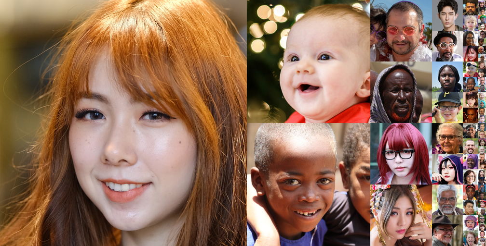
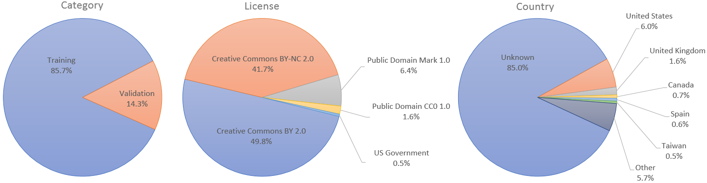

## Flickr-Faces-HQ Dataset (FFHQ)




Flickr-Faces-HQ (FFHQ) is a high-quality image dataset of human faces, originally created as a benchmark for generative adversarial networks (GAN):

> **A Style-Based Generator Architecture for Generative Adversarial Networks**<br>
> Tero Karras (NVIDIA), Samuli Laine (NVIDIA), Timo Aila (NVIDIA)<br>
> https://arxiv.org/abs/1812.04948

The dataset consists of 70,000 high-quality PNG images at 1024&times;1024 resolution and contains considerable variation in terms of age, ethnicity and image background. It also has good coverage of accessories such as eyeglasses, sunglasses, hats, etc. The images were crawled from [Flickr](https://www.flickr.com/), thus inheriting all the biases of that website, and automatically aligned and cropped using [dlib](http://dlib.net/). Only images under permissive licenses were collected. Various automatic filters were used to prune the set, and finally [Amazon Mechanical Turk](https://www.mturk.com/) was used to remove the occasional statues, paintings, or photos of photos.

Please note that this dataset is not intended for, and should not be used for, development or improvement of facial recognition technologies.  For business inquiries, please visit our website and submit the form: [NVIDIA Research Licensing](https://www.nvidia.com/en-us/research/inquiries/)

## Licenses

The individual images were published in Flickr by their respective authors under either [Creative Commons BY 2.0](https://creativecommons.org/licenses/by/2.0/), [Creative Commons BY-NC 2.0](https://creativecommons.org/licenses/by-nc/2.0/), [Public Domain Mark 1.0](https://creativecommons.org/publicdomain/mark/1.0/), [Public Domain CC0 1.0](https://creativecommons.org/publicdomain/zero/1.0/), or [U.S. Government Works](http://www.usa.gov/copyright.shtml) license. All of these licenses allow **free use, redistribution, and adaptation for non-commercial purposes**. However, some of them require giving **appropriate credit** to the original author, as well as **indicating any changes** that were made to the images. The license and original author of each image are indicated in the metadata.

* [https://creativecommons.org/licenses/by/2.0/](https://creativecommons.org/licenses/by/2.0/)
* [https://creativecommons.org/licenses/by-nc/2.0/](https://creativecommons.org/licenses/by-nc/2.0/)
* [https://creativecommons.org/publicdomain/mark/1.0/](https://creativecommons.org/publicdomain/mark/1.0/)
* [https://creativecommons.org/publicdomain/zero/1.0/](https://creativecommons.org/publicdomain/zero/1.0/)
* [http://www.usa.gov/copyright.shtml](http://www.usa.gov/copyright.shtml)

The dataset itself (including JSON metadata, download script, and documentation) is made available under [Creative Commons BY-NC-SA 4.0](https://creativecommons.org/licenses/by-nc-sa/4.0/) license by NVIDIA Corporation. You can **use, redistribute, and adapt it for non-commercial purposes**, as long as you (a) give appropriate credit by **citing our paper**, (b) **indicate any changes** that you've made, and (c) distribute any derivative works **under the same license**.

* [https://creativecommons.org/licenses/by-nc-sa/4.0/](https://creativecommons.org/licenses/by-nc-sa/4.0/)

## Overview

All data is hosted on Google Drive:

| Path | Size | Files | Format | Description
| :--- | :--: | ----: | :----: | :----------
| [ffhq-dataset](https://drive.google.com/open?id=1u2xu7bSrWxrbUxk-dT-UvEJq8IjdmNTP) | 2.56 TB | 210,014 | | Main folder
| &boxvr;&nbsp; [ffhq-dataset-v2.json](https://drive.google.com/open?id=16N0RV4fHI6joBuKbQAoG34V_cQk7vxSA) | 255 MB | 1 | JSON | Metadata including copyright info, URLs, etc.
| &boxvr;&nbsp; [images1024x1024](https://drive.google.com/open?id=1tZUcXDBeOibC6jcMCtgRRz67pzrAHeHL) | 89.1 GB | 70,000 | PNG | Aligned and cropped images at 1024&times;1024
| &boxvr;&nbsp; [thumbnails128x128](https://drive.google.com/open?id=1tg-Ur7d4vk1T8Bn0pPpUSQPxlPGBlGfv) | 1.95 GB | 70,000 | PNG | Thumbnails at 128&times;128
| &boxvr;&nbsp; [in-the-wild-images](https://drive.google.com/open?id=1ZX7QOy6LZuTLTnsOtQk-kmKq2-69l5hu) | 955 GB | 70,000 | PNG | Original images from Flickr
| &boxvr;&nbsp; [tfrecords](https://drive.google.com/open?id=1LTBpJ0W_WLjqza3zdayligS8Dh1V1gA6) | 273 GB | 9 | tfrecords | Multi-resolution data for [StyleGAN](https://github.com/NVlabs/stylegan) and [StyleGAN2](https://github.com/NVlabs/stylegan2)
| &boxur;&nbsp; [zips](https://drive.google.com/open?id=1WocxvZ4GEZ1DI8dOz30aSj2zT6pkATYS) | 1.28 TB | 4 | ZIP | Contents of each folder as a ZIP archive.

High-level statistics:



For use cases that require separate training and validation sets, we have appointed the first 60,000 images to be used for training and the remaining 10,000 for validation. In the [StyleGAN paper](https://arxiv.org/abs/1812.04948), however, we used all 70,000 images for training.

We have explicitly made sure that there are no duplicate images in the dataset itself. However, please note that the `in-the-wild` folder may contain multiple copies of the same image in cases where we extracted several different faces from the same image.

## Download script

You can either grab the data directly from Google Drive or use the provided [download script](./download_ffhq.py). The script makes things considerably easier by automatically downloading all the requested files, verifying their checksums, retrying each file several times on error, and employing multiple concurrent connections to maximize bandwidth.

```
> python download_ffhq.py -h
usage: download_ffhq.py [-h] [-j] [-s] [-i] [-t] [-w] [-r] [-a]
                        [--num_threads NUM] [--status_delay SEC]
                        [--timing_window LEN] [--chunk_size KB]
                        [--num_attempts NUM]

Download Flickr-Face-HQ (FFHQ) dataset to current working directory.

optional arguments:
  -h, --help            show this help message and exit
  -j, --json            download metadata as JSON (254 MB)
  -s, --stats           print statistics about the dataset
  -i, --images          download 1024x1024 images as PNG (89.1 GB)
  -t, --thumbs          download 128x128 thumbnails as PNG (1.95 GB)
  -w, --wilds           download in-the-wild images as PNG (955 GB)
  -r, --tfrecords       download multi-resolution TFRecords (273 GB)
  -a, --align           recreate 1024x1024 images from in-the-wild images
  --num_threads NUM     number of concurrent download threads (default: 32)
  --status_delay SEC    time between download status prints (default: 0.2)
  --timing_window LEN   samples for estimating download eta (default: 50)
  --chunk_size KB       chunk size for each download thread (default: 128)
  --num_attempts NUM    number of download attempts per file (default: 10)
  --random-shift SHIFT  standard deviation of random crop rectangle jitter
  --retry-crops         retry random shift if crop rectangle falls outside image (up to 1000
                        times)
  --no-rotation         keep the original orientation of images
  --no-padding          do not apply blur-padding outside and near the image borders
  --source-dir DIR      where to find already downloaded FFHQ source data
```

```
> python ..\download_ffhq.py --json --images
Downloading JSON metadata...
\ 100.00% done  2/2 files  0.25/0.25 GB   43.21 MB/s  ETA: done
Parsing JSON metadata...
Downloading 70000 files...
| 100.00% done  70001/70001 files  89.19 GB/89.19 GB  59.87 MB/s  ETA: done
```

The script also serves as a reference implementation of the automated scheme that we used to align and crop the images. Once you have downloaded the in-the-wild images with `python download_ffhq.py --wilds`, you can run `python download_ffhq.py --align` to reproduce exact replicas of the aligned 1024&times;1024 images using the facial landmark locations included in the metadata.

### Reproducing the unaligned FFHQ

To reproduce the "unaligned FFHQ" dataset as used in the [Alias-Free Generative Adversarial Networks](https://arxiv.org/abs/2106.12423) paper, use the following options:

```
python download_ffhq.py \
    --source-dir <path/to/downloaded/ffhq> \
    --align --no-rotation --random-shift 0.2 --no-padding --retry-crops
```


## Metadata

The `ffhq-dataset-v2.json` file contains the following information for each image in a machine-readable format:

```
{
  "0": {                                                 # Image index
    "category": "training",                              # Training or validation
    "metadata": {                                        # Info about the original Flickr photo:
      "photo_url": "https://www.flickr.com/photos/...",  # - Flickr URL
      "photo_title": "DSCF0899.JPG",                     # - File name
      "author": "Jeremy Frumkin",                        # - Author
      "country": "",                                     # - Country where the photo was taken
      "license": "Attribution-NonCommercial License",    # - License name
      "license_url": "https://creativecommons.org/...",  # - License detail URL
      "date_uploaded": "2007-08-16",                     # - Date when the photo was uploaded to Flickr
      "date_crawled": "2018-10-10"                       # - Date when the photo was crawled from Flickr
    },
    "image": {                                           # Info about the aligned 1024x1024 image:
      "file_url": "https://drive.google.com/...",        # - Google Drive URL
      "file_path": "images1024x1024/00000/00000.png",    # - Google Drive path
      "file_size": 1488194,                              # - Size of the PNG file in bytes
      "file_md5": "ddeaeea6ce59569643715759d537fd1b",    # - MD5 checksum of the PNG file
      "pixel_size": [1024, 1024],                        # - Image dimensions
      "pixel_md5": "47238b44dfb87644460cbdcc4607e289",   # - MD5 checksum of the raw pixel data
      "face_landmarks": [...]                            # - 68 face landmarks reported by dlib
    },
    "thumbnail": {                                       # Info about the 128x128 thumbnail:
      "file_url": "https://drive.google.com/...",        # - Google Drive URL
      "file_path": "thumbnails128x128/00000/00000.png",  # - Google Drive path
      "file_size": 29050,                                # - Size of the PNG file in bytes
      "file_md5": "bd3e40b2ba20f76b55dc282907b89cd1",    # - MD5 checksum of the PNG file
      "pixel_size": [128, 128],                          # - Image dimensions
      "pixel_md5": "38d7e93eb9a796d0e65f8c64de8ba161"    # - MD5 checksum of the raw pixel data
    },
    "in_the_wild": {                                     # Info about the in-the-wild image:
      "file_url": "https://drive.google.com/...",        # - Google Drive URL
      "file_path": "in-the-wild-images/00000/00000.png", # - Google Drive path
      "file_size": 3991569,                              # - Size of the PNG file in bytes
      "file_md5": "1dc0287e73e485efb0516a80ce9d42b4",    # - MD5 checksum of the PNG file
      "pixel_size": [2016, 1512],                        # - Image dimensions
      "pixel_md5": "86b3470c42e33235d76b979161fb2327",   # - MD5 checksum of the raw pixel data
      "face_rect": [667, 410, 1438, 1181],               # - Axis-aligned rectangle of the face region
      "face_landmarks": [...],                           # - 68 face landmarks reported by dlib
      "face_quad": [...]                                 # - Aligned quad of the face region
    }
  },
  ...
}
```

## Acknowledgements

We thank Jaakko Lehtinen, David Luebke, and Tuomas Kynk&auml;&auml;nniemi for in-depth discussions and helpful comments; Janne Hellsten, Tero Kuosmanen, and Pekka J&auml;nis for compute infrastructure and help with the code release.

We also thank Vahid Kazemi and Josephine Sullivan for their work on automatic face detection and alignment that enabled us to collect the data in the first place:

> **One Millisecond Face Alignment with an Ensemble of Regression Trees**<br>
> Vahid Kazemi, Josephine Sullivan<br>
> Proc. CVPR 2014<br>
> https://www.cv-foundation.org/openaccess/content_cvpr_2014/papers/Kazemi_One_Millisecond_Face_2014_CVPR_paper.pdf

## Privacy

When collecting the data, we were careful to only include photos that &ndash; to the best of our knowledge &ndash; were intended for free use and redistribution by their respective authors. That said, we are committed to protecting the privacy of individuals who do not wish their photos to be included.

To find out whether your photo is included in the Flickr-Faces-HQ dataset, please [click this link](https://nvlabs.github.io/ffhq-dataset/search/) to search the dataset with your Flickr username.

To get your photo removed from the Flickr-Faces-HQ dataset:

1. Go to Flickr and do one of the following:
    - Tag the photo with `no_cv` to indicate that you do not wish it to be used for computer vision research.
    - Change the license of the photo to `None` (All rights reserved) or any Creative Commons license with `NoDerivs` to indicate that you do not want it to be redistributed.
    - Make the photo private, i.e., only visible to you and your friends/family.
    - Get the photo removed from Flickr altogether.
2. Contact [researchinquiries@nvidia.com](mailto:researchinquiries@nvidia.com). Please include your Flickr username in the email.
3. We will check the status of all photos from the particular user and update the dataset accordingly.
